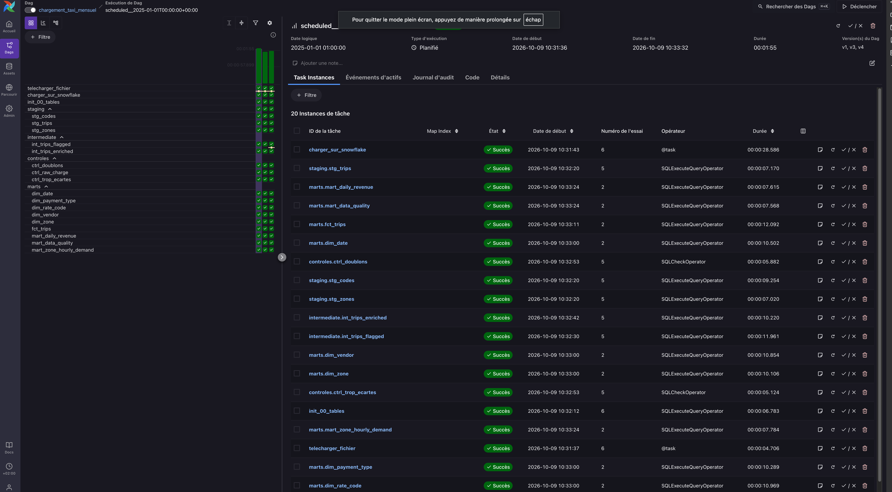

# 🚕 NYC Taxi Data Pipeline - Hudson Cab Partners

Bienvenue dans le dépôt du projet **Hudson Cab Partners**, un pipeline de données complet et automatisé visant à analyser les trajets des célèbres taxis jaunes de New York.

Ce projet met en place une architecture moderne de traitement de données (Data Warehouse) en suivant les meilleures pratiques du Data Engineering : architecture médaillon, orchestration, contrôles de qualité, idempotence et sécurité.

---

## 🛠 Architecture et Outils

Ce pipeline repose sur une **Architecture Médaillon** (RAW ➔ STAGING ➔ INTERMEDIATE ➔ MARTS) construite avec la stack technique suivante :

* **[Snowflake](https://www.snowflake.com/)** : Data Warehouse Cloud. Gère le stockage, les transformations SQL et la séparation stricte des rôles (RBAC).
* **[Apache Airflow](https://airflow.apache.org/) (via Astro CLI)** : Orchestrateur. Planifie, exécute et surveille l'ensemble du pipeline de données.
* **[DuckDB](https://duckdb.org/) & Python** : Utilisés pour l'exploration initiale des fichiers sources Parquet (exploration in-memory).

---

## 🔄 Le Pipeline de Données (DAG Airflow)

Le pipeline complet est géré par le DAG `chargement_taxi_mensuel` qui s'exécute mensuellement et garantit l'idempotence des chargements.

1. **Chargement (Ingestion)** : Téléchargement du fichier source TLC (Parquet) via Python et copie dans la couche **RAW** de Snowflake via un Stage interne (`COPY INTO` avec nettoyage préalable).
2. **Init Tables** : Création ou vérification de l'existence des tables cibles (pour assurer la ré-exécutabilité).
3. **Staging** : Typage et renommage standardisé des données brutes (vues SQL).
4. **Intermediate** : Nettoyage métier. Ajout des règles de gestion, calcul des durées/vitesses et isolation des trajets considérés comme "anormaux" (ex: montants négatifs, durées aberrantes).
5. **Contrôles (Data Quality)** : Arrêt du pipeline si les exigences ne sont pas remplies :
   * Vérification du chargement effectif.
   * Traque stricte des doublons.
   * Contrôle du taux de trajets écartés (seuil d'alerte).
6. **Marts** : Modélisation dimensionnelle (En étoile : 1 Table de Faits + 5 Dimensions) et création des vues agrégées pour l'analyse métier finale.

### Aperçu du DAG
*(Remplacer l'image ci-dessous par la capture d'écran de l'interface Airflow au vert)*


---

## 🔐 Sécurité & Gouvernance

La sécurité est implémentée au niveau de Snowflake grâce à une politique de **moindre privilège** (RBAC) :
* Le rôle `ROLE_HUDSON` a été créé spécifiquement pour le robot de service (Airflow).
* Il possède les droits de création et d'écriture **uniquement** sur la base de données `NYC_TAXI` et utilise un entrepôt de calcul dédié (`HUDSON_WH` de taille XSMALL pour maîtriser les coûts).
* Il lui est techniquement impossible d'interagir avec les autres bases du compte Snowflake.

---

## 📊 Résultats et Insights Métier

La problématique posée par la direction était : **"Où et quand la demande de taxis jaunes est-elle la plus forte à New York, et combien rapporte un trajet selon la zone, l'heure et le mode de paiement ?"**

L'analyse de l'entrepôt de données (couche `MARTS`) nous a permis de dresser le **Top 10 des segments les plus demandés** :

| Zone de prise en charge | Heure | Mode de Paiement | Nb Trajets | Revenu Moyen ($) |
|---|---|---|---|---|
| **Midtown Center** | 18h | Carte de crédit | 38 263 | 25.06 $ |
| **Midtown Center** | 17h | Carte de crédit | 38 027 | 26.35 $ |
| **Midtown Center** | 19h | Carte de crédit | 31 661 | 24.25 $ |
| **Midtown Center** | 16h | Carte de crédit | 30 696 | 26.53 $ |
| **Upper East Side South**| 15h | Carte de crédit | 29 985 | 20.34 $ |
| **Upper East Side South**| 14h | Carte de crédit | 29 854 | 20.41 $ |
| **Upper East Side North**| 15h | Carte de crédit | 29 757 | 20.64 $ |
| **Upper East Side South**| 17h | Carte de crédit | 29 751 | 22.00 $ |
| **Upper East Side South**| 18h | Carte de crédit | 29 553 | 21.54 $ |
| **Upper East Side South**| 16h | Carte de crédit | 28 712 | 22.06 $ |

### 💡 Ce qu'il faut en retenir
1. L'hypercentre financier et résidentiel (**Midtown Center** et **Upper East Side**) concentre la très grande majorité des courses à forte demande.
2. La demande explose **pendant les heures de pointe de l'après-midi et du soir** (entre 14h et 19h), au moment de la sortie des bureaux.
3. La **carte de crédit** est le mode de paiement dominant de manière absolue sur ces segments ultra-concurrentiels. Les revenus moyens y oscillent **entre 20$ et 26$** par course.

*(Retrouvez le détail de l'analyse dans le dossier `docs/` : [Réponse à la Direction](docs/REPONSE.md) et [Fiche Source](docs/fiche_trajets.md))*

---

## 🚀 Comment lancer le projet en local

1. Clonez ce dépôt.
2. Assurez-vous d'avoir Docker et l'Astro CLI installés.
3. Configurez vos identifiants Snowflake dans une variable d'environnement ou directement dans l'interface Airflow (Connection ID : `snowflake_nyc_taxi`).
4. Lancez le serveur Airflow local :
   ```bash
   astro dev start
   ```
5. Accédez à l'interface Airflow sur `http://localhost:8080`, activez le DAG et observez la magie opérer !
